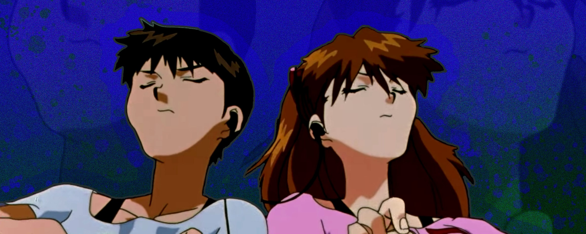

  

# Relación 3 parte 1 - Lenguaje de Marcas
## Contenido

>  **Archivos .html** de los ejercicios 1-8
>  
>  **Carpeta css** con documentos .css del 1-8
>  
>  **Carpeta img** con imagenes usadas en la relación de ejercicios
>  
>  **Carpeta doc** con .pdf con enunciado de los ejercicios
>  
>  **Archivo README.md**

## Hecho por

* **Roberto Torcal Aznal** - *Trabajo de LMSGI de 1ASIRA* - [mi github](https://github.com/torcalaznalroberto)
